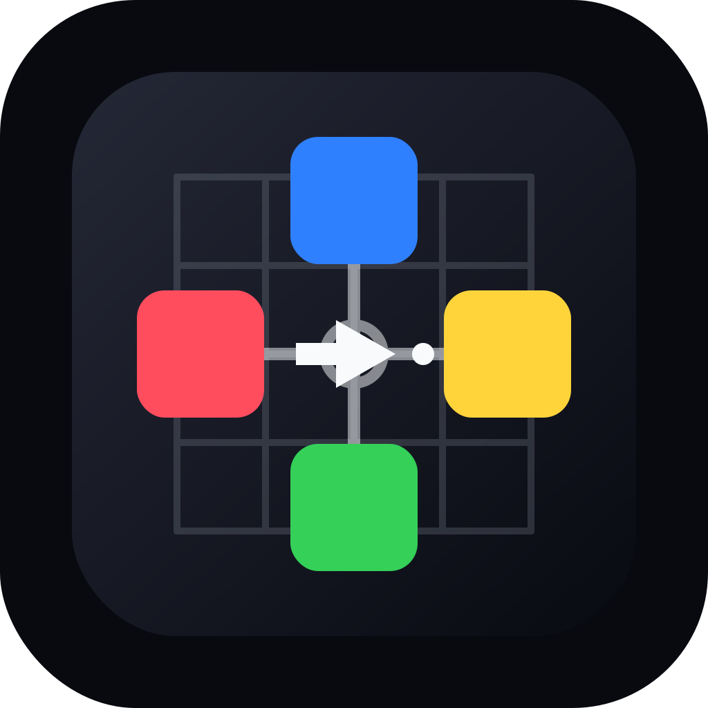

<div align="center">
  <a href="https://github.com/mrueda/pad-lattice">
    
  </a>
  <p><em>Launchpad control surface for coding agents</em></p>
</div>


[](LICENSE)

---

# Pad-Lattice

**Pad-Lattice** turns a Novation Launchpad Pro Mk1 into a hardware control
surface for autonomous coding agents. It provides visible agent state,
dedicated approval controls, and a local socket protocol that agent
integrations can use without owning the MIDI device directly.

Pad-Lattice is not a macro keyboard. The useful part is the always-on LED
surface: a spatial status display for supervising agents while they read,
edit, test, wait for input, or require approval.

# Table of contents

- [Installation](#installation)
- [Quick Start](#quick-start)
- [CLI](#cli)
- [Socket Protocol](#socket-protocol)
- [Current Layout](#current-layout)
- [Architecture](#architecture)
- [Hardware and Environment](#hardware-and-environment)
- [Development](#development)
- [Roadmap](#roadmap)
- [Citation](#citation)
- [Author](#author)
- [Copyright and license](#copyright-and-license)

# Installation

Install locally from the repository root:

```bash
python3 -m pip install -e .
```

Pad-Lattice requires Python 3.10 or newer and uses:

- `mido`
- `python-rtmidi`

# Quick Start

List available MIDI ports:

```bash
pad-lattice ports
```

Run the hardware demo:

```bash
pad-lattice demo
```

Run the durable sidecar daemon:

```bash
pad-lattice daemon
```

Send a state to the daemon from another process:

```bash
pad-lattice send-state waiting_for_reply
pad-lattice send-state running
pad-lattice send-state waiting_for_approval
pad-lattice send-state success
pad-lattice send-state error
```

Listen for Launchpad button actions:

```bash
pad-lattice listen-actions
```

# CLI

| Command | Purpose |
| --- | --- |
| `pad-lattice ports` | List MIDI input and output ports. |
| `pad-lattice demo` | Run the standalone hardware demo loop. |
| `pad-lattice daemon` | Own the Launchpad and expose the local socket API. |
| `pad-lattice send-state STATE` | Send an agent state to the daemon. |
| `pad-lattice listen-actions` | Print Launchpad actions emitted by the daemon. |

The demo starts by scrolling `HELLO FROM CODEX CLI` across the Launchpad, then
switches to the state and control display.

Tune the greeting speed:

```bash
pad-lattice demo --greeting-delay 0.12
```

If auto-detection picks the wrong MIDI port, pass explicit names:

```bash
pad-lattice demo --input "Launchpad Pro" --output "Launchpad Pro"
pad-lattice daemon --input "Launchpad Pro" --output "Launchpad Pro"
```

# Socket Protocol

The daemon owns the Launchpad MIDI ports and exposes a local Unix socket. Other
processes send newline-delimited JSON messages to that socket.

State message:

```json
{"type":"state","state":"waiting_for_reply"}
```

Action message:

```json
{"type":"action","action":"approve"}
```

Subscribe to action messages:

```json
{"type":"subscribe_actions"}
```

By default, the socket path is selected in this order:

1. `PAD_LATTICE_SOCKET`
2. `$XDG_RUNTIME_DIR/pad-lattice.sock`
3. `/tmp/pad-lattice-$UID.sock`

Codex integration should target this socket via hooks, remote control, or a
small adapter. The protocol is intentionally agent-agnostic so other coding
agents can use the same daemon.

# Current Layout

The state area uses shape and motion, not color alone:

| State | Display |
| --- | --- |
| Running | Steady blue center block with one slow activity dot. |
| Waiting for reply | Steady white question mark. |
| User typing | Steady white input line. |
| Waiting for approval | Steady yellow frame. |
| Success | Green checkmark. |
| Error | Red X. |

The current control layout assumes Launchpad Pro programmer-style grid notes:

| Control | Pad | Action |
| --- | --- | --- |
| Approve | `11` | `approve` |
| Reject | `12` | `reject` |
| Retry | `17` | `retry` |
| Stop | `18` | `stop` |

The four center pads `44`, `45`, `54`, and `55` display the current agent
state.

# Architecture

Pad-Lattice separates hardware ownership from agent integration:

```text
Agent backend
  -> Pad-Lattice socket protocol
  -> Pad-Lattice daemon
  -> Launchpad renderer
  -> Launchpad LEDs and controls
```

The renderer receives abstract events and actions. It does not need to know
whether the backend is Codex CLI, Claude Code, Aider, Gemini CLI, Goose, or a
future coding agent.

Main modules:

| Module | Purpose |
| --- | --- |
| `pad_lattice.events` | Agent-agnostic states and control actions. |
| `pad_lattice.launchpad` | Launchpad LED rendering and pad press mapping. |
| `pad_lattice.daemon` | Local sidecar daemon and action broadcaster. |
| `pad_lattice.protocol` | JSON-line socket protocol helpers. |
| `pad_lattice.demo_agent` | Demo state cycle for hardware testing. |
| `pad_lattice.cli` | Command-line interface. |

# Hardware and Environment

Pad-Lattice currently targets the **Novation Launchpad Pro Mk1**. Other
Launchpad models or MIDI grid controllers may work later, but they are not the
current tested hardware target.

The initial development setup is:

- macOS host
- Ubuntu VM in Parallels
- Novation Launchpad Pro Mk1 connected directly to the VM through USB
  passthrough
- Codex CLI running inside the VM

Only one process can own the Launchpad MIDI ports at a time. Stop any existing
`pad-lattice demo` or `pad-lattice daemon` process before starting another one.

# Development

Run the test suite:

```bash
python3 -m unittest discover -s tests
```

Run bytecode compilation checks:

```bash
python3 -m py_compile src/pad_lattice/*.py tests/*.py
```

# Roadmap

Near-term goals:

- Add a first Codex CLI adapter that uses the daemon socket.
- Expand the action model for common approval and interruption workflows.
- Make the LED states more readable under normal desk lighting.
- Add documentation for Launchpad Pro setup and troubleshooting.

Longer-term ideas:

- Repository activity map.
- Workflow phase visualization.
- Risk or confidence display for approvals.
- Support for additional coding agents.
- Support for additional MIDI grid controllers.

# Citation

No formal citation is available yet. For now, cite the GitHub repository:

Pad-Lattice: Launchpad control surface for coding agents.
https://github.com/mrueda/pad-lattice

# Author

Written by Manuel Rueda (mrueda). GitHub repository:
[https://github.com/mrueda/pad-lattice](https://github.com/mrueda/pad-lattice).

# Copyright and license

Copyright (C) 2026 Manuel Rueda.

Please see the included [LICENSE](LICENSE) file for distribution and usage
terms.
