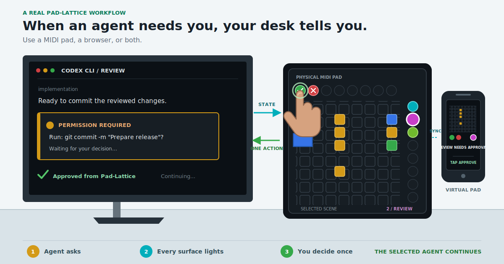

<div align="center">
  <a href="https://github.com/mrueda/pad-lattice">
    
  </a>
  <p><em>Physical and virtual control surfaces for AI agents</em></p>
</div>

# Pad-Lattice

[](https://github.com/mrueda/pad-lattice/actions/workflows/build-and-test.yml)
[](https://github.com/mrueda/pad-lattice/actions/workflows/documentation.yml)
[](https://github.com/mrueda/pad-lattice/blob/main/pyproject.toml)
[](https://github.com/mrueda/pad-lattice/blob/main/LICENSE)

**🎛️ Try the virtual pad:** <https://mrueda.github.io/pad-lattice/play/>

**📘 Documentation:** <https://mrueda.github.io/pad-lattice/>

**🚀 Quick Start:** <https://mrueda.github.io/pad-lattice/docs/usage/quickstart>

**Pad-Lattice gives people a tactile, glanceable way to monitor and control AI
agents.** It repurposes MIDI pad controllers as that physical interface: their
RGB grids can display agent state and accept deliberate actions. The same
visual language also runs as a Virtual Pad in the browser, so anyone can use it
from a phone, tablet, or computer, with or without MIDI hardware.

Pad-Lattice grew from [mrueda](https://github.com/mrueda)'s personal need to
interact more directly with Codex CLI. As a musician and member of the duo [The
New Assembly](https://www.thenewassembly.com/), he had used a Launchpad Pro
with Ableton Live and recognized that its mature grid interface could become a
visual surface for agents. Read the [origin
story](https://mrueda.github.io/pad-lattice/docs/about/origin-and-development).

<div align="center">
  
</div>

One local daemon maintains multi-agent state and routes currently available
actions only to the selected agent. **Visual Protocol 1** gives physical MIDI
profiles and the Virtual Pad the same identity accents, state glyphs,
selection, actions, and overflow behavior.

The first integration is **Codex CLI**. Pad-Lattice displays lifecycle state
and can return targeted Approve, Reject, Retry, and Stop actions while prompts
and terminal output remain in Codex.

Pad-Lattice is alpha software.

## Choose a Surface

| Surface | Command | Result |
| --- | --- | --- |
| Public browser | [Open `/play/`](https://mrueda.github.io/pad-lattice/play/) | Demo, protocol sandbox, and audiovisual Show; no installation. |
| Local browser | `pad-lattice web` | Real Codex control on the same computer. |
| Phone or tablet | `pad-lattice web --lan` | Real Codex control after one-time pairing on a trusted local network. |
| Launchpad | `pad-lattice daemon` | Physical MIDI input and RGB state feedback. |
| Launchpad plus browsers | `pad-lattice daemon --web` | Synchronized physical and virtual surfaces on one control plane. |

The public demo is intentionally simulated. Real control always requires the
local Pad-Lattice process and Codex hooks.

## Install and Start

Install the current GitHub version in an isolated environment:

```bash
pipx install git+https://github.com/mrueda/pad-lattice.git
```

Start the browser controller without MIDI hardware:

```bash
pad-lattice web
```

Then launch an integrated Codex session from another terminal:

```bash
pad-lattice codex --label implementation
```

To add a physical controller and optional synchronized browsers:

```bash
pad-lattice daemon --web --audio-feedback
```

The [Quick Start](https://mrueda.github.io/pad-lattice/docs/usage/quickstart)
covers hook review, MIDI setup, LAN pairing, and multiple sessions.

## Supported Hardware

| Device | Profile ID | Status |
| --- | --- | --- |
| Novation Launchpad Pro Mk1 | `novation/launchpad/pro-mk1` | **Supported and physically tested** |
| Novation Launchpad Mini Mk3 | `novation/launchpad/mini-mk3` | **Experimental; testers wanted** |
| Novation Launchpad Pro Mk3 | `novation/launchpad/pro-mk3` | **Experimental; testers wanted** |

Declarative JSON profiles map Visual Protocol 1 to MIDI ports, programmer
mode, note layouts, palettes, actions, selectors, and status indicators. New
controllers do not require changes to Codex integrations.

## Documentation

| Topic | Guide |
| --- | --- |
| Install and connect Codex | [Quick Start](https://mrueda.github.io/pad-lattice/docs/usage/quickstart) |
| Learn the colors, glyphs, actions, and 8x8 layout | [Visual Protocol](https://mrueda.github.io/pad-lattice/docs/technical-details/visual-language) |
| Connect phones, tablets, and laptops | [Browser Setup](https://mrueda.github.io/pad-lattice/docs/usage/connect-browsers) |
| Run the guided Demo or audiovisual Show | [Visual Show](https://mrueda.github.io/pad-lattice/docs/usage/visual-show) |
| Add or test a MIDI controller | [Device Profiles](https://mrueda.github.io/pad-lattice/docs/technical-details/device-profiles) |
| Understand or extend the implementation | [Technical Guide](https://mrueda.github.io/pad-lattice/docs/technical-details/) |
| Review the trust boundary | [Security Model](https://mrueda.github.io/pad-lattice/docs/technical-details/security-model) |

Release history is recorded in [CHANGELOG.md](CHANGELOG.md).

## Development Approach

Pad-Lattice is an independent hobby project developed by
[mrueda](https://github.com/mrueda) in his free time. It is developed through
an architecture-led, human-in-the-loop collaboration with Codex CLI (OpenAI,
GPT-5.6), automated testing, and evaluation on physical and virtual surfaces.
The [origin and development
page](https://mrueda.github.io/pad-lattice/docs/about/origin-and-development)
documents the process.

## Citation

No formal publication is available yet. For now, cite:

> Pad-Lattice: A Visual Protocol for AI Agent Control on MIDI and Virtual Pad
> Surfaces.
> <https://github.com/mrueda/pad-lattice>

## Author

Created and maintained by [mrueda](https://github.com/mrueda).

## Copyright and License

Copyright (C) 2026 Manuel Rueda.

Distributed under the Apache License 2.0. See [LICENSE](LICENSE).
